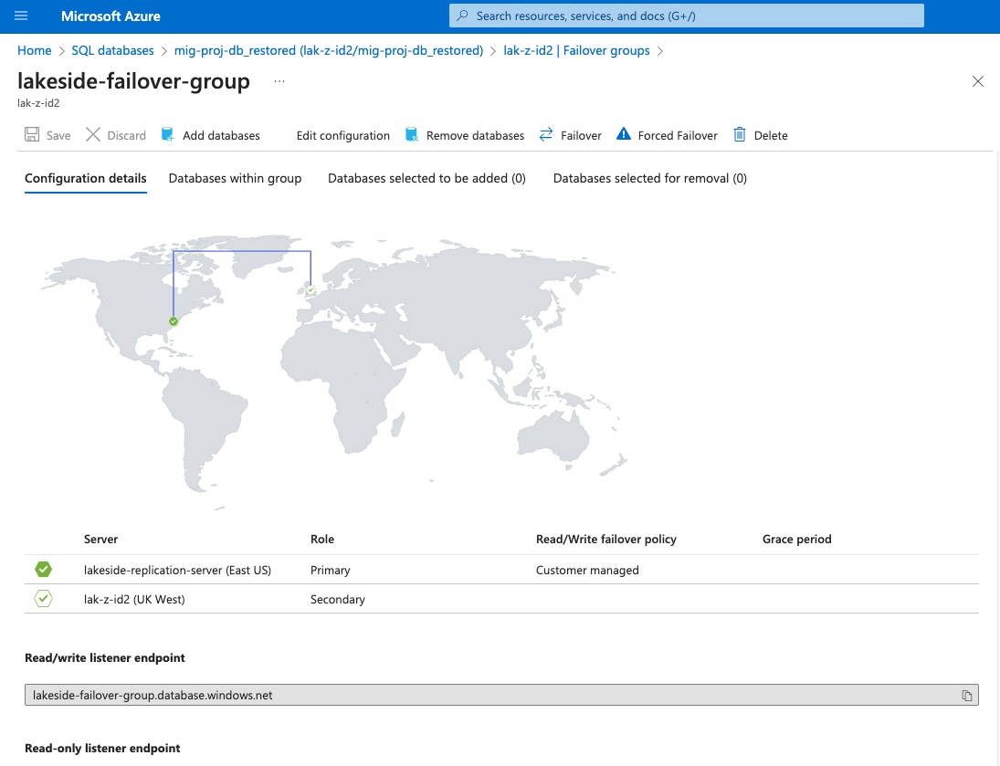

# azure-database-migration236

## Table of Contents

- [azure-database-migration236](#azure-database-migration236)
  - [Table of Contents](#table-of-contents)
    - [Project Title](#project-title)
    - [Project Description](#project-description)
    - [Setting up Production Environment](#setting-up-production-environment)
    - [Migrating to Azure SQL Database](#migrating-to-azure-sql-database)
    - [Data Backup and Restore](#data-backup-and-restore)
    - [Disaster Recovery Simulation](#disaster-recovery-simulation)
    - [Geo Replication and Failover](#geo-replication-and-failover)
    - [Microsoft Entra Directory Integration](#microsoft-entra-directory-integration)
    - [Creating DB Reader User](#creating-db-reader-user)
    - [Database Migration Diagram Schema](#database-migration-diagram-schema)
    - [License Information](#license-information)
    - [Author](#author)
    - [Acknowledgments](#acknowledgments)

### Project Title

Azure Database Migration

### Project Description

The aim of this is to architect and implement a Cloud-Based Database system on Microsoft Azure. In the project, an On-Premise Database will be transitioned to the Azure SQL Database.

A Windows VM will be provisioned on Azure to serve as the production environment. This VM will host the On-Premise Database which will later be migrated to the Azure SQL Database.

A backup of the On-Premise Database will be created and the backup will be securely stored on Azure Blob Storage.

Another Windows VM will be provisioned on Azure and this will serves as the development environment (testing). The reason for this VM is to have a separate environment where we can stimulate disaster recovery scenarios without impacting our live data in production environment.

SQL Server Management Studio will be utilized to create an automated backup solution of the development environment and the backup will be uploaded to the Blob Storage.

To enhance data protection, a Geo-replication will be configured for the production database by establishing a synchronized copy of the production database to the Azure SQL Database in a secondary region. This is a strategic redundancy which will ensure a continuos data availability and reduces any potential downtime during any unforeseen disruptions.

FInally, a disaster recovery will be simulated by intentionally mimicking data loss in the production environment.

### Setting up Production Environment

The first requirement of this project is the have an Azure account because this project will utilize different services running on Azure.

A production environment will be setup by provisioning a Windows VM on Azure. After provisioning the Production VM, Remote Desktop Service (RDS) access to the Production VM will be configured.

Using Remote Desktop Protocol (RDP) and Microsoft Remote Desktop, a remote connection will be established to the production VM and the following actions will be performed on the VM:

- **Download and install SQL Server**
    
    >*SQL Server* is a robust and widely used Relational Database Management System (RDMS) and it will be used together with SQL Server Management Studio (SSMS) to manage the database in this project. [Click here](https://www.microsoft.com/en-gb/sql-server/sql-server-downloads) to download SQL Server for Windows.

  
- **Download and install SQL Server ManagementStudio (SSMS)**
   
     >*SQL Server Management Studio (SSMS)* is a powerful graphical user interface (GUI) tool provided by Microsoft for managing SQL Server instances and databases. It serves as a central hub for database administrators and developers to perform various tasks related to SQL Server.  
     After a successful SQL Server installation, SSMS will be available to install.Alternatively, it can be downloaded by [clicking here](https://learn.microsoft.com/en-us/sql/ssms/download-sql-server-management-studio-ssms?view=sql-server-ver16). 
 
- **Create the Production Database**
    
    >A production Database called *AdventureWorks* will be created by restoring from a the backup file from [this link](https://aicore-portal-public-prod-307050600709.s3.eu-west-1.amazonaws.com/project-files/93dd5a0c-212d-48eb-ad51-df521a9b4e9c/AdventureWorks2022.bak). The database is a sample database with various tables, views, stored procedures, and data with a rich and diverse dataset.

### Migrating to Azure SQL Database

The focus here is to migrate the production database, the on-premise database, to the Azure Cloud Database. In order to achieve this, the following actions will be performed:

- **Create Azure Database**
    
  >This is the Azure Database that will serve as the target for migrating your on-premise database. To create an Azure Database, an Azure SQL Server will need to be created first. This will serves as the logical container for the cloud databases. The SQL Server will have the appropriate firewall rules to allow our specific IP address to access the server.
   After creating the server successfully, the next step is to create the *SQL database*. SQL Database supports two primary authentication methods: *Microsoft Entra ID* authentication and *SQL Server authentication*. For now, we will use the *SQL Server authentication* (SQL Server username and password).

- **Install Azure Data Studio**
    
  >Azure Data Studio is is a lightweight cross-platform data management and development tool with connectivity to popular cloud and on-premises databases.  
   Download Azure Data Studio from [here](https://learn.microsoft.com/en-us/azure-data-studio/download-azure-data-studio?tabs=win-install%2Cwin-user-install%2Credhat-install%2Cwindows-uninstall%2Credhat-uninstall)

- **Connect to Azure Database**
    
  >In the Azure Data Studio, we will connect to both the on-premise that is running on the VM and the Azure cloud databases that we created earlier. This will sever as the starting point for the migration process.

- **Schema Migration**
    
  >The next stage is migrating the schema in the on-premise database to the Azure cloud database. Before we can do this, we need to first download and install the *SQL Server Scheme Compare* extension. This extension is a valuable tool for seamless database migration. It simplifies the comparison and synchronization of database schemas.

- **Data Migration**
    
  >It should be noted data will not be migrated during schema migration, therefore, we need to perform the data migration process. we need to download and install another extension called  *Azure SQL Migration* in Azure Data Studio.

### Data Backup and Restore

In this milestone, we will create a backup of the on-premise database and store upload the backup in the Azure Cloud Blob Storage. The first step is to configure an Azure Storage account this will serve as a secure online repository for the database backups  of storage container in the Azure Cloud.

A full backup of the production database on the Windows VM will be taken and once the backup is completed it will be then be uploaded to the Azure Blob Storage.

In preparation for disaster recovery simulation, another Windows VM will be provisioned. This will act as our development environment. On development Windows VM, SQL Server will be installed to mimic the necessary database infrastructure.

Finally, we will proceed to restore the database backup onto this development environment. This allow us to safely explore and experiment while we still have the main production data unaffected.

On the development Windows VM, we will utilize SSMS to establish a Management Task that automates regular backups of the development database. A weekly backup schedule will be configured to ensure consistent protection for our evolving work and simplify recovery for of the development environment if needed.

### Disaster Recovery Simulation

In order to simulate disaster recovery, we will mimic a data loss in the Production environment by intentionally performing an UPDATE on the Person.Person table. We will set the *Firstname*, *MiddleName*, and *LastName* to *'NA'*

 

As we can see from the images above, we intentionally manipulate the data in the database, after the manipulation, the production database was restored back to a point just before the simulated data loss using the Azure SQL Database backup.

### Geo Replication and Failover

In this milestone, a Geo-Relication of the Production Database was configured. Geo-Replication enhances data protection by establishing a synchronized copy of the production Azure SQL Database in a secondary region. 

A replica of the database was created on another SQL server called *lakeside-replication-server* and this is located in another geographical location *East US* - Secondary region. The original Database is on the server called *lak-z-id2* and this is located is *UK West* - Primary region. See the image below:

A simulation of a real-world situation was performed by orchestrating a planned failover to the secondary region to test the failover.

### Microsoft Entra Directory Integration

In order to have a more organized way to manage access to the data stored on the database, we will integrate Microsoft Entra Directory to the Azure SQL Database.

Microsoft Entra ID is Microsoft's cloud-based identity and access management service, designed to help organizations manage and secure their users, applications, and data. When it comes to Azure resources, including Azure SQL Database, traditional username/password-based authentication may not provide the level of security and convenience required by modern cloud-based applications. That is where Microsoft Entra ID integration comes in.

Integrating Microsoft Entra ID with Azure SQL Database offers a range of advantages that enhance security, simplify user management, and enable a more seamless user experience. This integration leverages the power of identity-based authentication and access control, providing a robust and scalable solution for managing database access in a multi-tenant cloud environment.

### Creating DB Reader User

TO create a DB reader user, we need to first generate a new user account in the Microsoft Entra ID. This user account will serve as the BD Reader user.

In the Azure Studio, we will connect to the Production Database using the Microsoft Entra admin credentials then we will assign the db_datareader role to the DB Reader that we created earlier.

Note that this role will only provide the user with a *read-only* privileges. We then reconnect to the Production Database using the Azure Data Studio and the credentials of the new DB Reader AD user.

To test the permission of the DB Reader User, we try to perform a deletion operation on the database, and as expected the operation failed because the user only have read only permission.

### Database Migration Diagram Schema

### License Information

This project is licensed under the [GNU General Public License](https://www.gnu.org/licenses/gpl-3.0.en.html).

### Author

***Name: Olawale Olalekan***

### Acknowledgments

AiCore.
